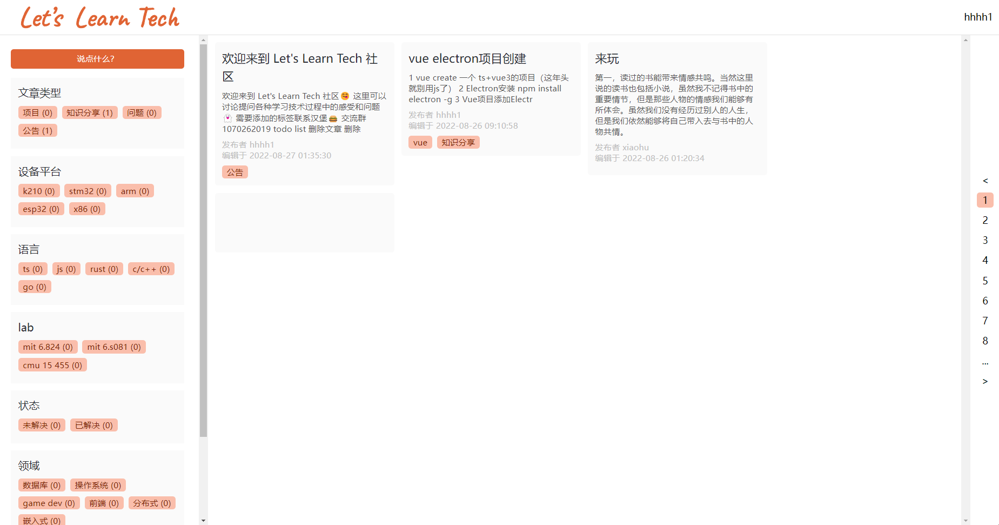

# LearnTechTogether

使用Rust和React开发的交流社区平台



## 技术栈

前端：`React`


后端: `Rust` `axum` 

数据库:`Postgrpesql`

接口测试:`ApiFox`

## TODO List

1. 评论修改
2. 删除文章
3. 删除评论
4. 权限系统
5. tag筛选
6. tag增删改接口
7. 消息提醒
8. q群机器人

## Done

1. ~~x 密码换成非明文~~
   1. ~~x 加密接口提供~~
   2. ~~x 初始运行将原有密码转换为加密密码

## 后端开发
使用rust进行开发，使用rust的第三库axum作为接口服务器，使用tokio处理数据库和io,使用serde_json进行接口json数据的序列化
和反序列化。服务器开启于本地地址3000端口，为前端提供接口服务。
目前有如下接口
### 用户模块
todo
### 用户注册(已实现)
前端需要传递注册者的邮箱，用户名，密码，验证码，由后端处理后返回相应状态码。
```json
   {
  "name":"xxx",
  "email": "xxx",
  "passwd": "xxx",
  "verify": "xxx"
}
```
### 用户登录（未实现）
前端传递（邮箱或用户名），密码，验证码给后端。
### manager 模块
不同的数据放到不同的数据库中，不应该对整个数据库服务器（一个服务器可能有多个数据库）上锁，只对数据库上锁。
数据库也会有多个，比如用户相关的就在用户库，文章相关的就在文章库，and so on,这个模块的出现，
就是为了管控数据库资源的。未来可能还会有Io manager管控文章，或者其他manager。

### cookie生成和检测(future)
避免用户重复登录。
### 验证码(未实现)
hash 请求者的ip得到一个六位数字，60秒过期并可以重新获取。
### 文章相关操作
文章有基本信息，最关键的是标签的处理。文章信息包含至多三个标签id。标签id对应到标签名称，
怎么检索相同标签的文章？我的思路是每个标签id直接建表，表里就存储文章的简短信息（比如id,title,author,link），
表名取名可以这样取tag_对应id，不过表太多维护也麻烦，所以把标签也单独开一个数据库。

### 后端todo

- 

## 前端开发

### 前端规范

- 模型与视图分离，模型使用**PaStateMan**管理
- 业务逻辑根据功能划分成proxy，通过从pastateman获取主proxy，在获取各个模块的proxy，proxy对操作逻辑进行封装。**界面**对数据的**读取**以及**逻辑的执行**都通过proxy进行
- 样式分为静态样式和动态
  - 静态样式放在assets/reuseable.less
  - 动态样式可通过joyui和emotion库进行动态创建
  - scheme文件夹里主要放给动态样式使用的特定样式
- layout中放所有的组件
  - 可复用组件放在useable中


